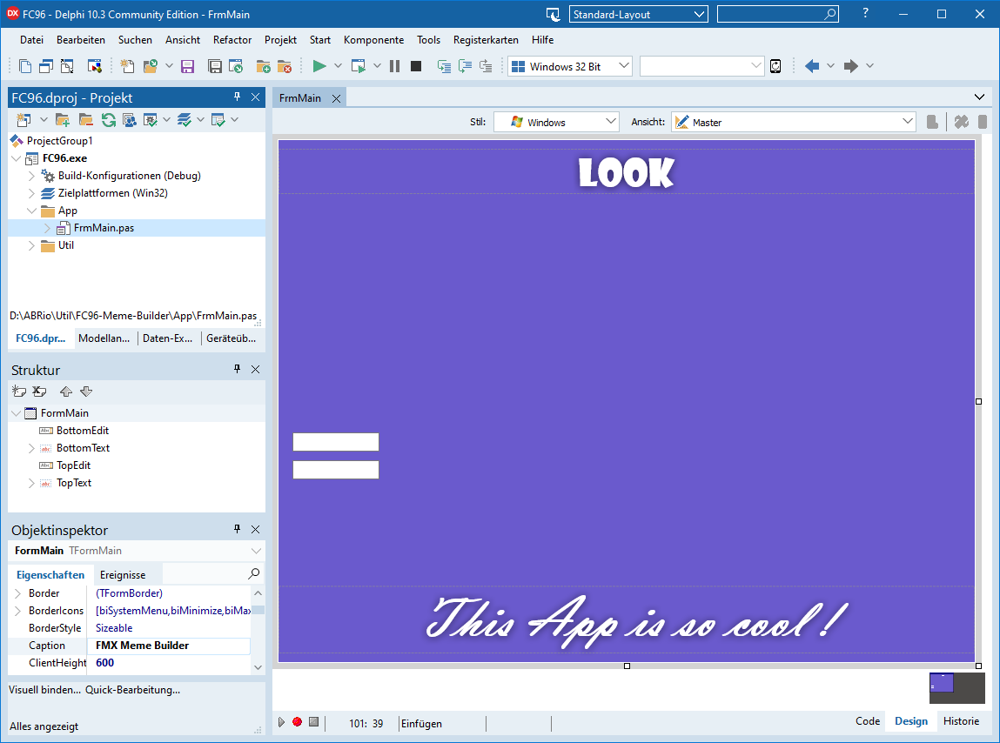

# Federgraph Meme Builder App

*Federgraph Meme Builder App, no image loaded yet.*<br>


Website [link](https://federgraph.de/federgraph-meme-builder-source.html) has more pictures.

It could be used as a companion app to the Federgraph application,
just in case you wanted to build a Meme with one of the Federgraph *Emoji* pictures.

Drop your image onto the drop target.

Then press Escape key to show the edit controls for the text (not visible in picture above),
and press Escape key again to hide the edits.

## Design

This is a small one-form-only Delphi FMX application.

( There is no configuration, because it would be overkill. )

- It has a drop target where you can drop the image, initially shown.
- The drop target can be hidden.
- A checker bitmap is shown when no actual image is loaded.
- It has an image component, of course.
- It has top and bottom text components, always shown.
- Both text components have a glow effect.
- It has top and bottom edit components to change the text, initially hidden.

You can edit, arrange and style the text,
and you should be able to copy the finished image to the clipboard. 

## Actions

There are 6 actions defined, by means of Integer action constants.

```pascal
const
  faTopMargin = 1;
  faBottomMargin = 2;
  faTopSize = 3;
  faBottomSize = 4;
  faTopGlow = 5;
  faBottomGlow = 6;
```

- Use the keyboard to trigger the action.
- These actions will select the current parameter.
- You are supposed to select a parameter and then use the scroll wheel to change the value of that parameter.

## Options

- **Font Name** used, choose the font from a limited set of hardcoded font names.
- **Form Size** chosen, you can switch between some standard sizes.
- **Default Text** used, you can play with some hardcoded combinations of top and bottom text.

## Keyboard usage

This is a desktop application. You need to use the keyboard and mouse wheel.

```pascal
procedure TFormMain.FormKeyUp(
  Sender: TObject; var Key: Word; var KeyChar: Char; Shift: TShiftState);
begin
  if Key = vkEscape then
  begin
    TopEdit.Visible := not TopEdit.Visible;
    BottomEdit.Visible := TopEdit.Visible;
    Caption := DefaultCaption;
  end;

  if Key = vkC then
  begin
    CopyBitmap;
    Caption := 'Bitmap copied.';
  end

  else if TopEdit.Visible then
    //do nothing when editing

  else if KeyChar = 'd' then
    DropTargetVisible := not DropTargetVisible

  else if KeyChar = 'c' then
    ClearImage

  else if KeyChar = 'f' then
    CycleFontP

  else if KeyChar = 'F' then
    CycleFontM

  else if KeyChar = 'g' then
    UpdateParam(faTopGlow)

  else if KeyChar = 'h' then
    UpdateParam(faBottomGlow)

  else if KeyChar = 't' then
    UpdateParam(faTopSize)

  else if KeyChar = 'b' then
    UpdateParam(faBottomSize)

  else if KeyChar = 'n' then
    UpdateParam(faTopMargin)

  else if KeyChar = 'm' then
    UpdateParam(faBottomMargin)

  else if KeyChar = 'r' then
    Caption := DefaultCaption

  else if KeyChar = 'R' then
    Reset

  else if KeyChar = 'x' then
  begin
    Inc(TestID);
    TestID := TestID mod 2;
    Reset;
  end

  else if KeyChar = '1' then
    UpdateFormat(640, 480)

  else if KeyChar = '2' then
    UpdateFormat(800, 600)

  else if KeyChar = '3' then
    UpdateFormat(1024, 768)

  else if KeyChar = '8' then
    UpdateFormat(800, 800)

  else if KeyChar = '9' then
    UpdateFormat(900, 900)

  else if KeyChar = '0' then
    UpdateFormat(1024, 1024)
end;
```

Using the keyboard you can

- change the visibility of the text edits
- show and hide the drop target
- change the size of the image (ClientWidth, ClientHeight)
- reset the text to hardcoded default
- cycle between alternative standard text definitions, if any
- cycle the font using a range of predefined font names
- select the current parameter, the value of which you want to change with the mouse wheel

Note that when you cycle through the fonts - it will apply the next font to the top or bottom text,
depending on what the current parameter is.

Key mapping recap:

| KeyChar(s) | Action |
|:---:|:---|
| Escape | toggle text edit controls |
| d | toggle drop target |
| 1, 2, 3, 8, 9, 0 | Window Format selection |
| b, t| param: bottom and top text size |
| m, n | param: bottom and top text margin |
| f, F| cycle Font, plus or minus |
| x | Cycle default Text plus Reset |
| r | Reset Caption command |
| R | Reset command |
| c | clear image command |
| ^c | copy image to clipboard command |

## The one an only Main Form

<a href="images/Meme-Builder-02.png">*Main Form at design time.*<br>
</a>