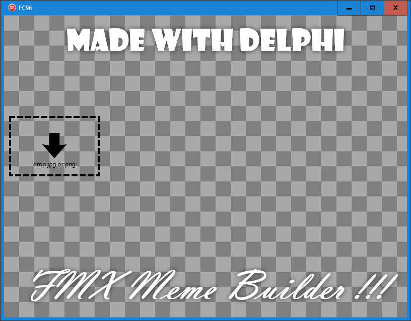

# Federgraph Meme Builder App

*Federgraph Meme Builder App, no image loaded yet.*<br>


Website [link](https://federgraph.de/federgraph-meme-builder-examples.html) has more pictures.

It could be used as a companion app to the Federgraph application,
just in case you wanted to build a Meme with one of the Federgraph *Emoji* pictures.

First drop your image onto the drop target,
next press Escape key to show the text edit controls.

> Press h key to toggle keyboard shortcut help text.

## Design

This is a small one-form-only Delphi FMX application.

( There is no configuration, because it would be overkill. )

- It has an image component of course, initially empty.
- It has a drop target where you can drop the image, initially shown.
- The drop target can be hidden.
- A checker bitmap is shown when no actual image is loaded.
- It has top and bottom text components, always shown.
- Font size is a parameter
- Text control Margin is a parameter
- Both text components have a glow effect.
- Glow softness is a parameter
- It has top and bottom text Edit components, initially hidden.

You can edit, arrange and style the text to some extent,
and you should be able to copy the finished image to the clipboard. 

The *invisible* application state includes the selected text (top or bottom) and the selected parameter.
You need to remember, hold a copy of those values in your head.

- If you cycle through fonts, it effects the selected text.
- If you scroll the mouse wheel, it effects the selected param, for the selected text.

## Fonts

Currently the list of hardcoded font family names are optimized for Windows 10 with Office installed.

I have just started to implement a fallback mode when those Office fonts are not available.

> I guess you want to change the Font used.

## Params

Look at actions first, because you need to trigger an action to select a parameter.

```pascal
const
  //fa = Federgraph Action
  faTopMargin = 1;
  faBottomMargin = 2;
  faTopSize = 3;
  faBottomSize = 4;
  faTopGlow = 5;
  faBottomGlow = 6;
```

As in the Federgraph App, the action values are defined as Integer constants.
They could be Enumeration values here, but not in the Federgraph App,
because a Delphi enum can hold a maximum of 256 values,
and Federgraph App has more.

Some of the actions are *mapped* to params.
When the action is triggered, a parameter is selected as current.
Then the mouse wheel can be used to change this parameter.

Parameters are at the heart of the App.

- First use the keyboard to select a param,
- then use the scroll wheel of the mouse to change the value of the current parameter.

This is the very basic principle of using the App, exactly as in the Federgraph App.

> And then there are Options, which you toggle on or off.

## Keyboard usage

You need a keyboard.

Using the keyboard you can:

- toggle the visibility of help text
- toggle the visibility of the drop target for the background image
- change the visibility of the text edit controls
- edit the text !
- cycle trough the list of predefined fonts
- change the size of the image (ClientWidth, ClientHeight)
- select the current parameter